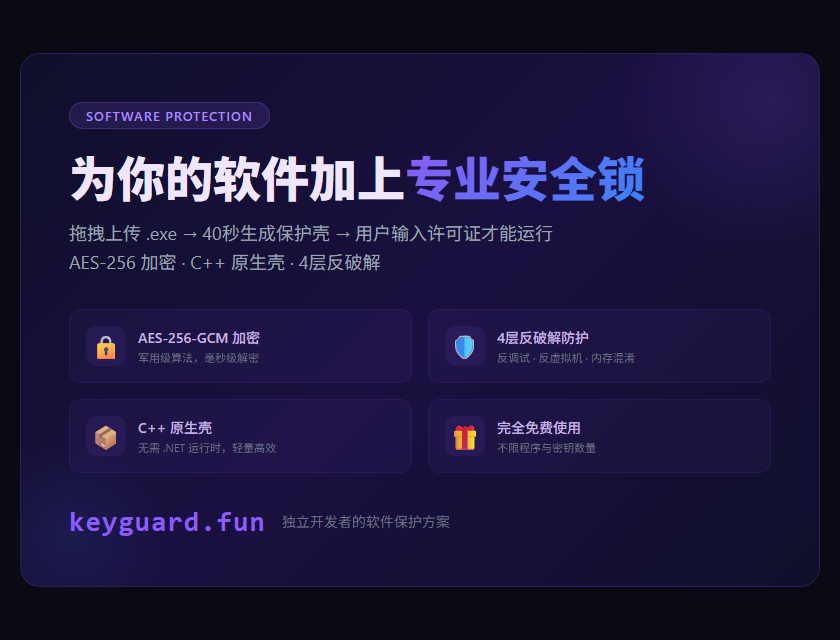

# KeyGuard · 软件加密保护系统

> 给 EXE / APK / PDF 加上一把"许可证锁"——客户不输入密钥，程序就打不开。

## 这是什么

KeyGuard 是一个在线软件加密与授权保护平台，面向独立开发者与小团队，用浏览器操作即可为软件和文档加上密钥授权保护：

- **EXE / DLL / JAR / APK**：C++ 原生保护壳包裹 + 卡密授权校验，客户输入密钥才能运行
- **PDF / 文档 / 图片 / 视频**：AES-256-GCM 加密，密钥 + 专属解密链接双重校验
- **密钥管理系统**：批量生成卡密、设置有效期、绑定机器码、随时禁用吊销
- **反破解加固**：防调试、反逆向、字符串加密、内存混淆、强制 HTTPS

## 快速开始

1. 打开 **[keyguard.fun](https://keyguard.fun)** 注册登录
2. 控制台拖拽上传你的程序或文件
3. 生成许可证密钥（卡密），分发受保护版本
4. 客户输入密钥即可使用；绑定机器码可防止一码多用

全程无需写代码，40 秒左右完成保护。

## 技术要点

- AES-256-GCM 加密落盘，明文不落地
- C++ 原生保护壳（无 .NET 托管代码，无法直接反编译）
- 机器码签名绑定，杜绝密钥传播
- 支持在线吊销、记录解锁日志

## 说明

任何软件保护都无法做到 100% 不可破解，KeyGuard 的作用是显著提高破解成本，让绝大多数破解尝试失去意义。

## 链接

- 官网：https://keyguard.fun
- 本文档仓库：https://github.com/05060102/keyguard
